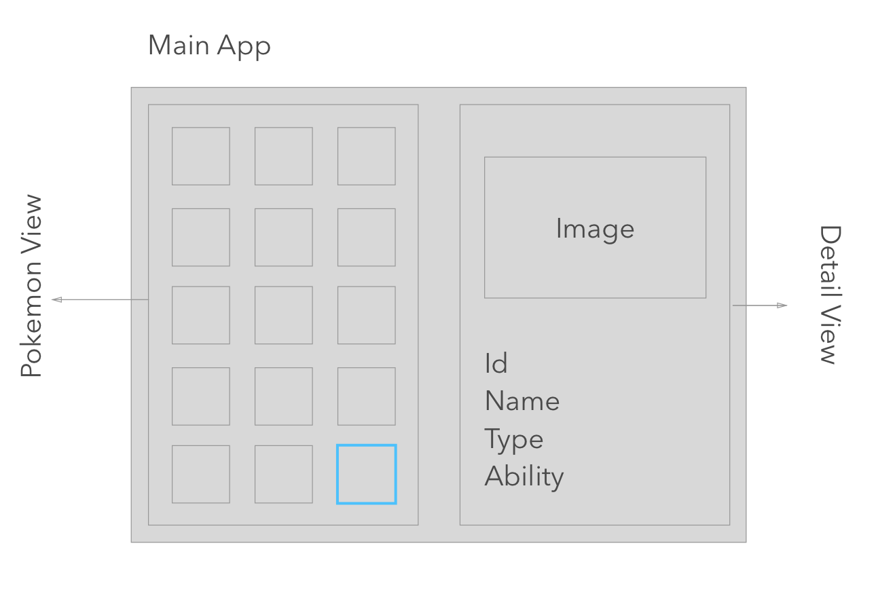
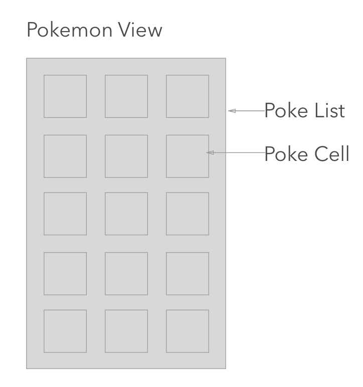
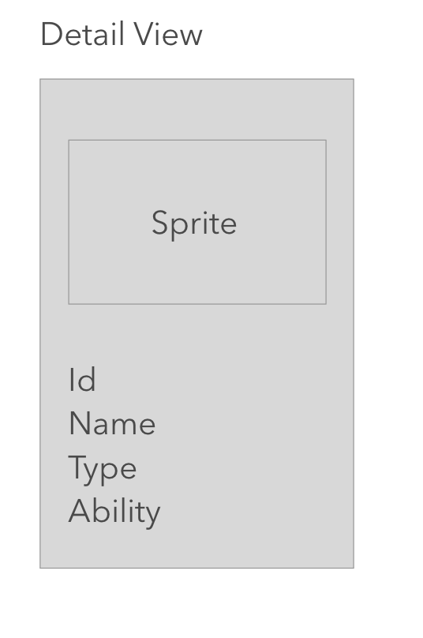
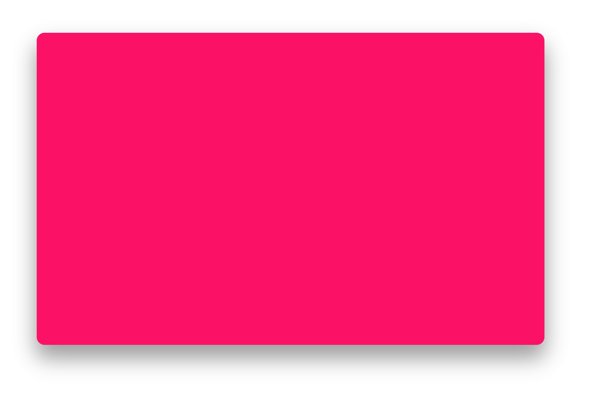
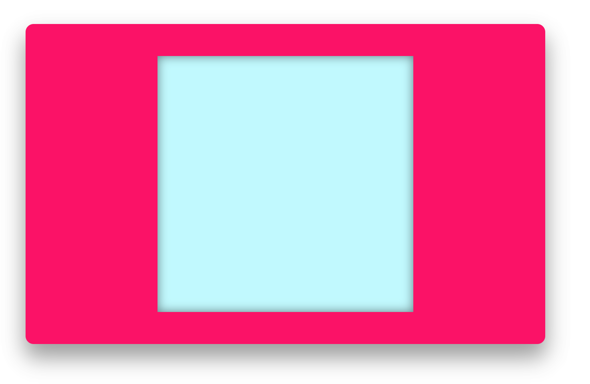
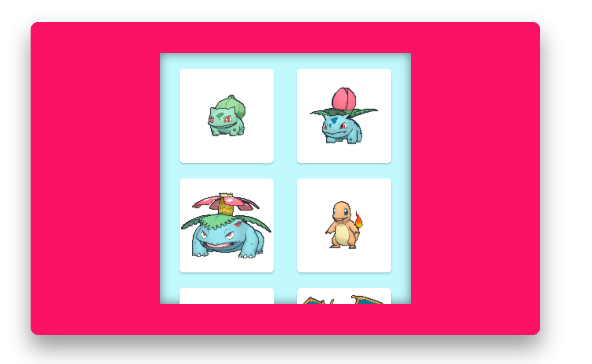
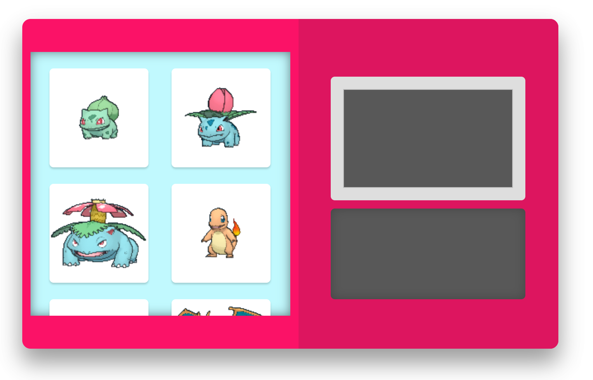
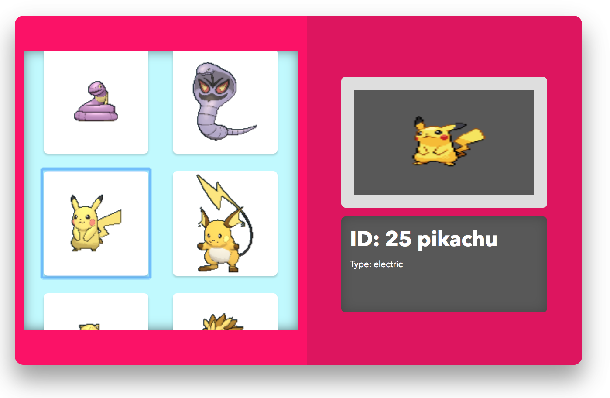

# Lets Build a Pokedex with React 

I love building web apps with React. However, learning how to use the library and getting used to the React thinking can be difficult. I believe that personal projects are the best way to learn new things, and thus started to build a Pokedex with React. I had a lot of fun building it and learned a lot, so I decided to make this beginners workshop for new developers interested in learning how to use React.

We are going to be using the [PokeApi](http://pokeapi.co/) to get all our Pokemon data and sprites.

* **Part 1:** we will set up the file
* **Part 2:** we will begin making our wireframes and main layout
* **Part 3:** we will build the PokeList view
* **Part 4:** we will build the Detail view
* **Part 5:** we will fetch all the data and connect all our views

# Without further ado, let's start coding.

# PART 1

If you want to skip the initial setup, clone the “basic” branch of this [repo](https://github.com/jdiejim/pokedex-blog). Otherwise, let's continue with the installation.

## Create React App Installation

First, you need to install [Node](https://nodejs.org/en/) version ≥ 6 on your machine.
Once installed, proceed to install the [create-react-app](https://github.com/facebookincubator/create-react-app) package globally with npm.

```

npm install -g create-react-app

```

## Setting up Create React App Boilerplate

First, create a new pokedex project and move into your new pokedex directory.

```

create-react-app pokedex
cd pokedex

```

Inside your pokedex directory you should see a **src** directory that contains the following files:

```
src/
│   App.css
|   App.js
│   App.test.js
|   index.css
|   index.js
|   logo.svg
|   registerServiceWorker.js

```

This is where we are going to tweak some files to make it more dynamic and easier to import/export files. Move into the **src** directory to start modifying some of the files.

```

cd src

```

First, remove the logo.svg file since we are no longer going to use it. 

```

rm logo.svg

```

Then create a **test** directory, a **components** directory, and a **styles** directory inside the new **components** directory.

```

mkdir test
mkdir components
mkdir components/styles

```

Then move the App files into their corresponding directories

```

mv App.js components/
mv App.css components/styles/
mv App.test.js test/

```

Your new file structure in the **src** directory should look like this:

```
src
|   index.css
|   index.js
|   registerServiceWorker.js
|
|___componets
|   |   App.js
|   |___styles
|       │   App.css
|
|___test
|   |   App.test.js

```

We are almost done. 

Open App.js and replace all the contents with the following code:

```javascript

import React, { Component } from 'react';
import './styles/App.css';

class App extends Component {
  render() {
    return (
      <div className="App">
        Hello World I am a Pokedex
      </div>
    );
  }
}

export default App;

```

Open App.css and delete all the contents inside. We are going to write our own styling so don't worry. 

Open index.css and replace all contents inside with this code:

```css

* {
  box-sizing: border-box;
}

body {
  margin: 0;
  padding: 0;
  font-family: 'Avenir Next', sans-serif;
}

h1,
h2,
h3,
h4,
p {
  margin: 0;
}

```

The **index.css** file will contain all our top-level styles. In this case we want all the document’s elements to have box-sizing of border box, and we also want to remove the margin for al h1, h2, h3, h4, p tags.

Finally, replace all the contents of the **index.js** file with the following code:

```javascript

import React from 'react';
import ReactDOM from 'react-dom';
import './index.css';
import App from './components/App';
import registerServiceWorker from './registerServiceWorker';

ReactDOM.render(<App />, document.getElementById('root'));
registerServiceWorker();

```

The only change we made here was changing the path of the App component.
We are not going to add anything else to **index.js**. However, it's important to know what is happening here. This file basically is telling the DOM to render the App component in the element with id of “root”. Our App component will contain all of our components that we are going to build.

Great! We are done with the setup. Let's try it out. To start our application write this command in your terminal:

```

npm start

```

This will start our application in the browser in development mode. Now every time we edit our project we are going to see our changes in the browser. If you have an error, the browser will display some information about the type of error and where to find it.

# PART 2

In Part 2 of this tutorial we are going to wireframe our app and start setting our main layout. To start at this point clone the branch “basic” of this [repo](https://github.com/jdiejim/pokedex-blog).

## WireFrame

React is all about building components so it is a good idea to make wireframes to map all of the components we need to build.

Our main app layout will contain 2 components: the Pokemon view, and the Detail view.

The Pokemon View will contain a scrollable PokeList component that wraps 151 buttons (PokeCell) of the first generation Pokemon. When a user clicks a PokeCell, the Detail View will display the selected Pokemon’s information and sprite.



### Pokemon View

The pokemon view will contain a scrollable **poke list component** that wraps all the **poke cell components**



### Detail View

The detail view will be only be its own component containing different elements.
 


Now that we are done with our wireframe lets begin setting the main app component.

## Component Types

There are 2 basic types of React components: Stateful and Stateless
StateFul components, as the name describes it, have their own state. In our application, the App component is going to be stateful because it will hold state of Pokemon data (more on this later). 

Let's start building our App component from scratch. Open **App.js** and delete all of the contents inside.

The first step is to import the React package and deconstruct the Component class from it.

  ```javascript

import React, { Component } from 'react';

  ```

  Then you need to create a new class App that extends Component. All stateful components require 2 main methods: 
  
  1. constructor: where we initialize our state
  2. render: where we write our jsx

  In the constructor, we always have to call the super() function since we are extending from the component class. Additionaly, we also need to declare our initial state. For now, leave it as an empty object. We are going to use this later in the tutorial.

  ```javascript

  class App extends Component {
    constructor() {
      super();
      this.state = {};
    }
  }

  ```

Next, add the render method. This method always returns jsx syntax, which is a mix of javaScript and html. The render method can only return one element so we need to create a parent element and nest children inside. If we are returning a nested element we need to wrap it with parentheses.

Anything after the return keyword has to be jsx. That means we can do regular javascript before the return keyword.

 ```javascript

  class App extends Component {
  constructor() {
    super();
    this.state = {};
  }

  render() {
    return (
      <div className="App">
        
      </div>
    );
  }
}

  ```

Finally, we need to import our stylesheet at the top to add the styles of our component and export the whole class so we can use it in other files.

```javascript

import React, { Component } from 'react';
import './styles/App.css';

class App extends Component {
  constructor() {
    super();
    this.state = {};
  }

  render() {
    return (
      <div className="App">
        
      </div>
    );
  }
}

export default App;

```

Open your **App.css** file and add the following styles to it:

```css

.App {
  display: flex; 
  align-items: center;
  justify-content: center;
  width: 650px;
  height: 400px;
  padding-left: 10px;
  margin: 50px auto;
  background-color: #FE0065;
  border-radius: 10px;
  box-shadow: 0 14px 45px rgba(0, 0, 0, 0.22), 0 18px 45px rgba(0, 0, 0, 0.22);
}

```

Here are some comments on the styles we added:

* We use display flex to separate the 2 views we are going to be building
* We fixed our width and height for our desktop display
* We apply some top and bottom margin to separate the view from the corners and auto left and right to place it in the middle
* Finally, we applied a red color to the background



# PART 3

To start at this point clone the branch 'part3' of this [repo](https://github.com/jdiejim/pokedex-blog)

## PokeList

Go to your components folder and create a **PokeList.js** file. Then go to your styles folder and create a **PokeList.css** file.

```

cd src/components/
touch PokeList.js styles/PokeList.css

```

**Stateless components** have a shorter setup. These type of components are just regular javaScript functions that return jsx. Since we don’t need the class keyword, we can avoid importing the Component class. However, we still need to import the React package.

Open your PokeList.js and follow this steps:

1. Import the React package
2. Import the PokeList styles
3. Create a new function named PokeList
4. Return an empty section with className poke-list
5. export the newly created function

``` javascript

import React from 'react';
import './styles/PokeList.css';

const PokeList = () => {
  return (
    <section className="poke-list">

    </section>
  )
}

export default PokeList;

```
Go to the **PokeList.css** file and add the following styles:

```css

.poke-list {
  display: flex;
  flex-wrap: wrap;
  justify-content: space-around;
  align-items: center;
  width: 50%;
  height: 80%;
  padding: 10px;
  margin-right: 10px;
  background-color: #BFF9FF;
  box-shadow: inset 0 0 20px rgba(0, 0, 0, 0.5);
  overflow: scroll;
}

```

Here are some comments on the styles we added:

* We are using display flex to take advantage of the wrap functionality since we are going to wrapping all the PokeCell buttons inside.
* We set the width to 50% to fill the left half of the app component
* We also included overflow scroll because not all of the PokeCells are going to be displayed at once.

Go back to App.js and import the PokeList component. 

To render our PokeList we are going to use another feature React gives us. All the components you want to render are placed as html tags. Place your PokeList component as a self-closing html tag inside the parent element. Start your application and see the results. Cool right!


```javascript

import React, { Component } from 'react';
import PokeList from './PokeList';
import './styles/App.css';

class App extends Component {
  constructor() {
    super();
    this.state = {};
  }

  render() {
    return (
      <div className="App">
        <PokeList />
      </div>
    );
  }
}

export default App;

```



## PokeCell

We are going to build a PokeCell component that will act as a template for each of the 150 Pokemon that we are going to render in PokeList.

Go to your **components** folder and create a **PokeCell.js** file. Then go to your styles folder and create a **PokeCell.css** file.

```

cd src/components/
touch PokeCell.js styles/PokeCell.css

```

Open your PokeCell.js and follow this steps:

1. Import the React package
2. Import the PokeCell styles
3. Create a new function named PokeCell
4. Return an empty button with className poke-cell
5. Export the newly created function

```javascript

import React from 'react';
import './styles/PokeCell.css';

const PokeCell = () => {
  return <button className="poke-cell"></button>;
};

export default PokeCell;

```


Go to the PokeCell.css file and add the following styles:

```css

.poke-cell {
  width: 120px;
  height: 120px;
  margin: 10px;
  background-color: #FFF;
  background-repeat: no-repeat;
  border: none;
  border-radius: 5px;
  box-shadow: 0 2px 2px 0 rgba(0, 0, 0, 0.16);
}

```

Notes on PokeCell style:

* We set the background-repeat to no-repeat for the background image we are going to put later in the tutorial

Finally, import the PokeCell component into PokeList.js, and render some cells in the list by placing them inside the parent element as an html elements.

```javascript

import React from 'react';
import PokeCell from './PokeCell';
import './styles/PokeList.css';

const PokeList = () => {
  return (
    <section className="poke-list">
      <PokeCell />
      <PokeCell />
      <PokeCell />
      <PokeCell />
      <PokeCell />
      <PokeCell />
    </section>
  )
}

export default PokeList;

```

## Sprites and Array Rendering

This section might be a little confusing, but I promise it is worth it. 

For this part of the tutorial please click and download the following resources: 

* [Sprites](https://github.com/jdiejim/pokedex-blog/blob/master/src/assets/sprites.png)
* [pokeClasses](https://github.com/jdiejim/pokedex-blog/blob/master/src/pokeClasses.js)

The sprites image is a collection of the first 151 Pokemon sprites. 

We are going to display each sprite using the PokeCell component and some css background properties (background-image, background-position).

The background positions can be found in the pokeClasses.js file, which has an array of objects containing the Pokemon id and position for each sprite.

Go to the src directory and follow the next steps:

1. Place the pokeClasses.js file inside the src directory.
2. Create an assets folder inside this directory, and place the sprites image inside the newly created assets folder.

Ok. Let's move on.

Go to PokeList.js and import the pokeClasses array.

```javascript

import React from 'react';
import PokeCell from './PokeCell';
import { pokeClasses } from '../pokeClasses';
import './styles/PokeList.css';

const PokeList = () => {
  return (
    <section className="poke-list">
    </section>
  )
}

export default PokeList;

```

Now for the fun part.

We need to render in our list all the 151 PokeCells with the correct data in them. To avoid writing all of them manually, we can use javaScript to our advantage. 

Back in our code, create a new array of PokeCells with the information of each element in the pokeClasses array.

To accomplish this, we are going to apply the array prototype map to our pokeClasses array and for each element of the array return a PokeCell tag. Then store this array of PokeCells in a new variable called cells.

```javascript

const cells = pokeClasses.map(pokeClass => <PokeCell />)

```

In React, components can pass values to their children as props. Props look like html attributes and are placed between the opening and closing tags. We can name props any way we want, and pass any variable type (string, number, object, function) through them.

We are going to use props to pass the pokeClass object to each PokeCell.

To accomplish this, add a new prop named pokeClass inside the PokeCell tag in the mapped array. Then assign it the pokeClass argument of the map callback. 

One thing I forgot to mention is that every time we want to include regular javaScript in a jsx section we need to wrap it with curly braces.

```javascript

const cells = pokeClasses.map(pokeClass => <PokeCell pokeClass={pokeClass} />)

```
Finally, every time we create an array of components, React requires us to include a prop named key with a unique value in it. Lucky for us, each pokeClass contains an id value, which we can use as our unique value. React uses this prop to make optimizations in the background.

The end result will look like this:

```javascript

import React from 'react';
import PokeCell from './PokeCell';
import { pokeClasses } from '../pokeClasses';
import './styles/PokeList.css';

const PokeList = () => {
  const cells = pokeClasses.map(pokeClass => <PokeCell key={pokeClass.id} pokeClass={pokeClass}/>)
  return (
    <section className="poke-list">
    </section>
  )
}

export default PokeList;

```

Now that we have our PokeCells array, we can render it by placing the cells variable inside the parent element wrapped with curly braces (since arrays are part of javaScript)

```javascript

import React from 'react';
import PokeCell from './PokeCell';
import { pokeClasses } from '../pokeClasses';
import './styles/PokeList.css';

const PokeList = () => {
  const cells = pokeClasses.map(pokeClass => <PokeCell key={pokeClass.id} pokeClass={pokeClass}/>)
  return (
    <section className="poke-list">
    {cells}
    </section>
  )
}

export default PokeList;

```

Cool right! Instead of manually placing each PokeCell inside the parent element, we can just place the cells array, and React will append each of the PokeCells to the list component.

## Rendering Sprites

Now that we passed the pokeClass object to each PokeCell, we can use this data to determine the position of each sprite in the sprite image and render the sprite in the background of each button.

Open your **PokeCell.js** file and follow these steps:

Since we are passing props to PokeCell, we need to include a props argument in the PokeCell function.

```javascript

const PokeCell = (props) => {
  return <button className="poke-cell"></button>
};

```

Because we know that the props object contains the pokeClass object, we can deconstruct the props argument to easily access the pokeClass object. Finally, we can deconstruct all the properties from the pokeClass itself and assign them to their own variable using the ES6 feature.

```javascript

const PokeCell = ({ pokeClass }) => {
  const { id, backgroundPosition } = pokeClass;

  return <button className="poke-cell"></button>
};

```

Then, import the sprites image at the top of the file.

```javascript

import sprites from '../assets/sprites.png';

```

To add the sprite as a background image, we are going to use **inline styling** on the button element.

First create a new styles object with two properties: backgroundImage and backgroundPosition. Notice that the css properties are written in camelCase instead of the regular format. This is because we are using javascript to add the in-line styling.

```javascript

import React from 'react';
import sprites from '../assets/sprites.png';
import './styles/PokeCell.css';

const PokeCell = ({ pokeClass }) => {
  const { id, backgroundPosition } = pokeClass;
  const style = { backgroundImage: '', backgroundPosition: '' };

  return <button className="poke-cell"></button>
};

export default PokeCell;
 
 ```

For the backgroundImage key, replace the empty string with the following code:

```javascript

  const style = { backgroundImage: `url(${sprites})`, backgroundPosition: '' };

```

Here we are placing the imported sprite image into the css url function using the string interpolation feature from ES6.

              If you console log the sprites image, you will see that it will log the path of the image. We have to do this because this is how React recognizes the path of the image.

For the backgroundPosition property, replace the empty string with the following code:

```javascript

  const style = { backgroundImage: `url(${sprites})`, backgroundPosition };

```

Because the name of the backgroundPosition property in the style object matches with the backgroundPosition variable we deconstructed from the pokeClass object, we can use the ES6 object literal shorthand feature to only include the name of the property.

Finally, add the in-line style object to the html element like this:

```javascript

import React from 'react';
import sprites from '../assets/sprites.png';
import './styles/PokeCell.css';

const PokeCell = ({ pokeClass }) => {
  const { id, backgroundPosition } = pokeClass;
  const style = { backgroundImage: `url(${sprites})`, backgroundPosition };

  return <button style={style} className="poke-cell"></button>
};

export default PokeCell;

```

Wow! That was a lot, but trust me it was worth it. This is the only section that is kind of confusing. Go ahead and start your application to see the result.



# PART 4

To start at this point clone the branch 'part4' of this [repo](https://github.com/jdiejim/pokedex-blog)


## Detail View

Go to your components folder and create a DetailView.js file. Then go to your styles folder and create a DetailView.css file.

```

cd src/components/
touch DetailView.js styles/DetailView.css

```

Open your DetailView.js and follow these steps:

1. Import the React package
2. Import the DetailView styles
3. Create a new function named DetailView
4. Return an empty section with className detail-view
5. Add elements to display the data and image.
6. Export the newly created function


```javascript

import React from 'react';
import './styles/DetailView.css';

const DetailView = () => {
  return (
    <section className="detail-view">
      
      <div className='data-wrapper'>
        <h1 className='data-name'></h1>
        <p className='data-char'></p>
        <p className='data-char'></p>
      </div>
    </section>
  )
}

export default DetailView;

```

Lets also add some style to our DetailView in the css file.

```css

.detail-view {
  display: flex;
  flex-direction: column;
  justify-content: center;
  width: 50%;
  height: 100%;
  padding: 10px;
  background-color: #df095e;
  border-bottom-right-radius: 10px;
  border-top-right-radius: 10px;
}

.sprite-image {
  width: 80%;
  height: 150px;
  margin: 10px auto;
  background-color: #585858;
  border: 15px solid #DEDEDE;
  border-radius: 5px;
  color: #585858;
}

.data-wrapper {
  width: 80%;
  height: 110px;
  padding: 10px;
  margin: 0 auto;
  background-color: #585858;
  border-radius: 5px;
  box-shadow: inset 0 0 20px rgba(0, 0, 0, 0.22);
  color: #FFF;
}

.data-name {
  margin: 0 0 5px;
}

.data-char {
  font-size: 10px;
}

```

Here are some comments on the styles we added:

* Sprite-image will contain the selected Pokemon sprite
* The data-char class refers to the characteristics of the Pokemon (id, name, type)

Go to App.js and import the DetailView component. Render it by placing the DetailView component as a self-closing html tag inside the parent element on the render function.

```javascript

import React, { Component } from 'react';
import PokeList from './PokeList';
import DetailView from './DetailView';
import './styles/App.css';

class App extends Component {
  constructor() {
    super();
    this.state = {};
  }

  render() {
    return (
      <div className="App">
        <PokeList />
        <DetailView />
      </div>
    );
  }
}

export default App;

```



# PART 5

This is the last part of the tutorial! In this part, we are going to manage **State**, and we will fetch data from the poke api. Finally, we will use the Pokemon data to populate the **DetailView**. To start at this point clone the branch “part5” of this [repo](https://github.com/jdiejim/pokedex-blog).

## Passing Events

We need to create a click event for each of our PokeCells to fetch the Pokemon data from the poke api. To do this first we are going to create the function as part of the App class, and then we will pass it as props to each of our PokeCells.

Open your **App.js** file, and create a **handleOnClick** function with an id parameter. In the function’s body include a console.log of the id argument.

```javascript

import React, { Component } from 'react';
import PokeList from './PokeList';
import DetailView from './DetailView';
import './styles/App.css';

class App extends Component {
  constructor() {
    super();
    this.state = {};
  }

  handleOnClick(id) {
    console.log(id);
  }

  render() {
    return (
      <div className="App">
        <PokeList />
        <DetailView />
      </div>
    );
  }
}

export default App;

```

Since we are passing down this function to the **PokeCells**, we need to pass it first through the **PokeList** component.
Add a new prop to the **PokeList** named **handleOnClick** and pass the **handleOnClick** function we just created.

```javascript

render() {
    return (
      <div className="App">
        <PokeList handleOnClick={this.handleOnClick} />
        <DetailView />
      </div>
    );
  }

```

We included the **this** keyword since **handleOnClick** is a method of the App class. This is how you normally pass functions as props from a class component. However, we will lose the context of **this** when we try to use this function on the **PokeList** component. To fix this issue, we need to bind the App context to the **handleOnClick** method. 
On the constructor function, use the bind method to bind **handleOnClick** to the current class:

```javascript

class App extends Component {
  constructor() {
    super();
    this.state = {};

    this.handleOnClick = this.handleOnClick.bind(this);
  }
}

```

Now the method will always have the context of App in other components when initialized.

Open your **PokeList** file and follow these steps:

1. Deconstruct **handleOnClick** from the **PokeList** arguments.
2. Add the **handleOnClick** method as a prop of **PokeCells**.


```javascript

const PokeList = ({ handleOnClick }) => {
  const cells = pokeClasses.map(pokeClass => {
    return (
      <PokeCell 
        key={pokeClass.id} 
        pokeClass={pokeClass} 
        handleOnClick={handleOnClick}
      />
    );
  });

  return (
    <section className="poke-list">
      {cells}
    </section>
  )
}

```

Open your **PokeCell** file and follow these steps:

1. Deconstruct **handleOnClick** from the **PokeCell** arguments.
2. Add an onClick event inside the button tab, and assign it an anonymous function that calls **handleOnClick** with the id variable as the parameter.

Now every time we click on a **PokeCell** button the id of the Pokemon clicked is going to be logged in the console.

```javascript

const PokeCell = ({ pokeClass, handleOnClick }) => {
  const { id, backgroundPosition } = pokeClass;
  const style = { backgroundImage: `url(${sprites})`, backgroundPosition };

  return <button onClick={() => handleOnClick(id)} style={style} className="poke-cell"></button>
};

```

Start your application and click on a PokeCell. You will be able to see the id of the Pokemon clicked in the console.

## Pokemon Helper

We are going to create a **Pokemon** class to clean the data from the api that we are going to fetch. This way we are able to manage the Pokemon data more easily.

```

touch Pokemon.js

```

On your **src** directory create a **Pokemon.js** file.

```javascript

class Pokemon {
  constructor(data) {
    this.id = data.id;
    this.name = data.name;
    this.sprite = data.sprites.front_default;
    this.type = data.types[0].type.name;    
  }
}

export default Pokemon;

```

Now when we fetch the data we can instantiate a new Pokemon object and pass it the fetched data.

## Fetching the Data

Open your **App.js** file and follow these steps:

1. Import the **Pokemon** class at the top of the file.
2. On the **handleOnClick** method, make a fetch request to the poke api. Use string interpolation to add a dynamic url path route with the id argument.
3. Resolve the fetch promise and create a new **Pokemon** instance with the fetched data.
4. Add a console.log of the Pokemon object to see the Pokemon data when a **PokeCell** is clicked.

```javascript
import React, { Component } from 'react';
import PokeList from './PokeList';
import DetailView from './DetailView';
import Pokemon from '../Pokemon';
import './styles/App.css';

// Inside the App class

handleOnClick(id) {
    fetch(`http://pokeapi.co/api/v2/pokemon/${id}/`)
      .then(res => res.json())
      .then(data => {
        const pokemon = new Pokemon(data);

        console.log(pokemon);
      })
      .catch(err => console.log(err));
  }
```

## State

Now that we successfully fetched our Pokemon data, we need to pass this data to the **DetailView** to display it.

To accomplish this, we first need to take the Pokemon object out of the resolved promise and store it in our App’s state.

On the constructor function of the App component, add a new key to the state object with the value of an empty object.

```javascript

  constructor() {
    super();
    this.state = {
      pokemon: {}
    };

    this.handleOnClick = this.handleOnClick.bind(this);
  }

  ```

To update the pokemon state, React gives us a function called **setState**. This function takes an object as an argument where we need to specify the key we want to update and assign it a new value. Every time this function is called, React re-renders all the child components.

To add the Pokemon data to state, replace the console.log with the **setState** function inside the **handleOnClick** function, and pass it the new Pokemon object we created.

  ```javascript

  handleOnClick(id) {
    fetch(`http://pokeapi.co/api/v2/pokemon/${id}/`)
      .then(res => res.json())
      .then(data => {
        const pokemon = new Pokemon(data);

        this.setState({ pokemon });
      })
      .catch(err => console.log(err));
  }

  ``` 

Now that we stored our Pokemon data on the App’s state, we can access it in the render function.

Pass the pokemon state to the **DetailView** component as a prop. Since, the state property is part of the App class, we need to include the **this** keyword to access it.

  ```javascript

  render() {
    return (
      <div className="App">
        <PokeList handleOnClick={this.handleOnClick} />
        <DetailView pokemon={this.state.pokemon} />
      </div>
    );
  }

  ```

## Displaying the Data

Open your **DetailView.js** file and follow these steps:

1. Deconstruct **pokemon** from the **DetailView** arguments.
2. Deconstruct the id, name, sprite, and type from the **pokemon** variable.
3. On the image tag, add a src attribute and assign it the sprite variable wrapped in curly braces.
4. Between the h1 tags add the id and name variables wrapped in curly braces.
5. On the p tag, add the type variable wrapped in curly braces.

```javascript

const DetailView = ({ pokemon }) => {
  const { id, name, sprite, type } = pokemon;

  return (
    <section className="detail-view">
      
      <div className='data-wrapper'>
        <h1 className='data-name'>ID: {id} {name}</h1>
        <p className="data-char">Type: {type}</p>
      </div>
    </section>
  )
}

```

We are done! Give yourself a high five! 

Go ahead and start your application to see the result.

Click on your favorite Pokemon and see their details displayed.


